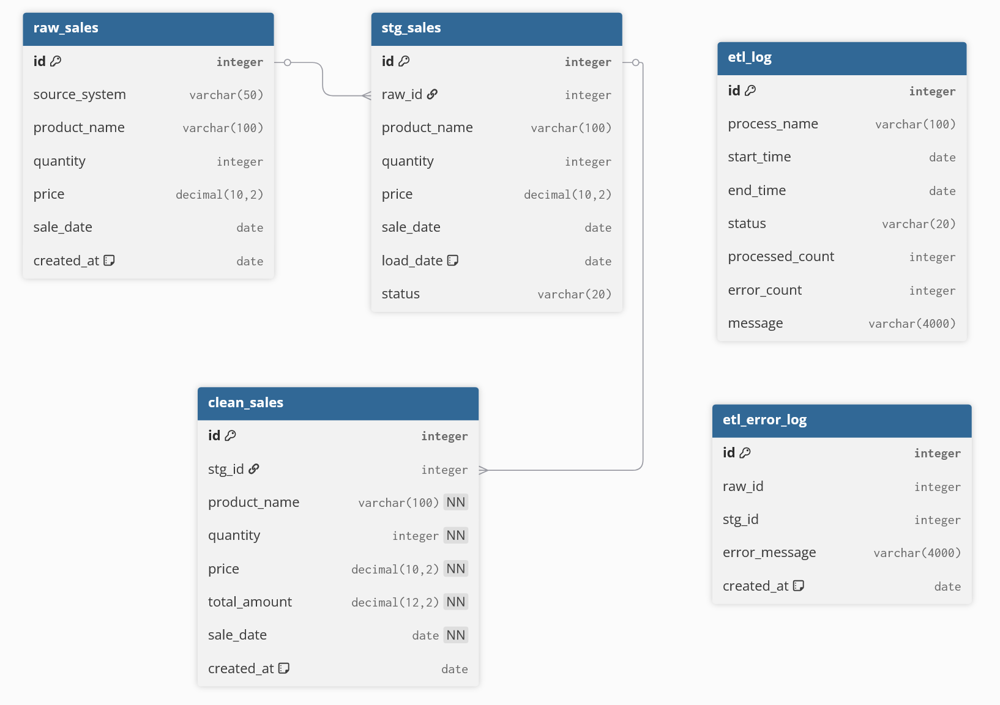
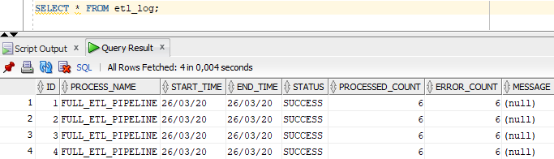
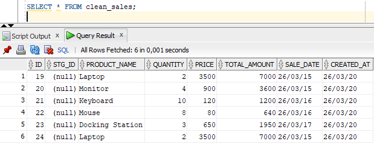
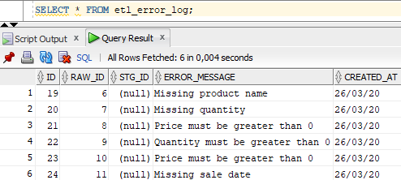
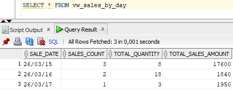

# Oracle PL/SQL Data Pipeline

##  Cel projektu

Projekt przedstawia implementację pipeline'u ETL w bazie danych Oracle z wykorzystaniem PL/SQL.

Celem projektu jest przetwarzanie surowych danych sprzedażowych, ich walidacja, oczyszczanie oraz przygotowanie do analizy poprzez zapis do tabeli docelowej.

---

##  Architektura rozwiązania
```
RAW → STAGING → CLEAN
        ↓
    ERROR LOG
```
### Diagram



## Przykładowe wyniki

### Log uruchomienia ETL


### Dane poprawne (clean_sales)


### Błędy danych (etl_error_log)



### Raport sprzedaży (vw_sales_by_day)


---

### Warstwy:

* RAW (`raw_sales`)
  Surowe dane wejściowe (mogą zawierać błędy)

* STAGING (`stg_sales`)
  Dane pośrednie z nadanym statusem:

  * NEW
  * VALID
  * INVALID

* CLEAN (`clean_sales`)
  Dane oczyszczone i gotowe do raportowania

* ERROR LOG (`etl_error_log`)
  Błędy walidacji

* ETL LOG (`etl_log`)
  Historia uruchomień pipeline


---

##  Uruchomienie projektu

Projekt należy uruchomić w Oracle SQL Developer lub SQL Plus.
```sql
@sql/run_all.sql
```

---

##  Proces ETL

Pipeline realizuje następujące kroki:

1. Załadunek danych do STAGING
2. Walidacja danych
3. Oznaczenie rekordów (VALID / INVALID)
4. Logowanie błędów
5. Ładowanie danych do CLEAN
6. Logowanie procesu

---

##  Reguły walidacji

Rekord jest poprawny, jeśli:

* product_name IS NOT NULL
* quantity IS NOT NULL AND quantity > 0
* price IS NOT NULL AND price > 0
* sale_date IS NOT NULL

---

## Testowanie

Projekt zawiera skrypt testowy:

`tests/test_etl.sql`

Testy sprawdzają:

* liczbę poprawnych rekordów
* liczbę błędów
* statusy w staging
* log wykonania ETL

Uruchom:

```sql
@tests/test_etl.sql
```

---

##  Widoki raportowe

* vw_sales_by_day
* vw_sales_by_product
* vw_etl_error_summary
* vw_etl_run_summary

---

##  Automatyzacja

Projekt wykorzystuje DBMS_SCHEDULER do uruchamiania pipeline automatycznie:

* job: ETL_PIPELINE_JOB
* harmonogram: codziennie

---

##  Jak uruchomić pipeline ręcznie

```sql
BEGIN
    etl_pkg.run_full_pipeline;
END;
/
```

---

##  Technologie

* Oracle Database
* PL/SQL
* SQL
* Oracle SQL Developer


## Autor 
Piotr Kut 
Student kierunku Inżynieria i Analiza Danych.